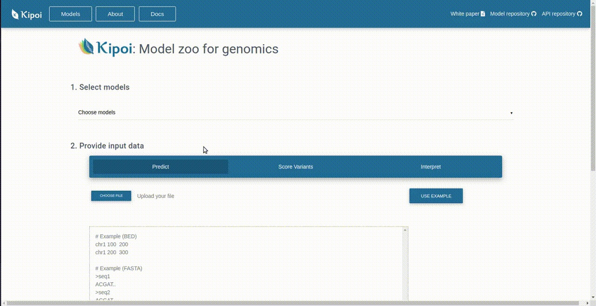

# Kipoi Webapp Kubernetes Setup

Requirements: You should have:

- Docker up and running. [Docker Installation Tutorial](https://www.digitalocean.com/community/tutorials/how-to-install-and-use-docker-on-ubuntu-18-04)
- kubectl and Minikube up and running. [Kubernetes Installation Tutorial](https://matthewpalmer.net/kubernetes-app-developer/articles/install-kubernetes-ubuntu-tutorial.html).

#### Download the repositories
Clone [Kipoi Webapp Backend](https://github.com/kipoi/kipoi-webapp-backend), [Kipoi Webapp Frontend](https://github.com/kipoi/demo-webapp-frontend) and [Kipoi Webapp Router](https://github.com/kipoi/kipoi-webapp-router) repositories. Ideally, they should be in the same 

Copy the `kubernetes` folder inside `kipoi-webapp-backend` directory into the same parent folder.

### Building and Publishing Backend Apps
Since there are two Kipoi environments, we have two different Flask apps to use those. Another app does the routing between them.

- Navigate into `kipoi-webapp-backend`
- Build the keras2 environment app: `docker build -f Dockerfile -t YOUR_DOCKER_USERNAME/kipoi-backend-keras2:latest .`
- Push the keras2 environment app: `docker push YOUR_DOCKER_USERNAME/kipoi-backend-keras2:latest`
- Build the keras1 environment app: `docker build -f Dockerfile2 -t YOUR_DOCKER_USERNAME/kipoi-backend-keras1:latest .`
- Push the keras1 environment app: `docker push YOUR_DOCKER_USERNAME/kipoi-backend-keras1:latest`

### Deploying Backend Pods on Kubernetes
- Navigate into `kubernetes` folder.
- Change `goktugerce` in `kipoi-backend-keras1-deployment.yaml` and `kipoi-backend-keras2-deployment.yaml` with `YOUR_DOCKER_USERNAME`.
- Deploy the Flask apps on pods:
    - `kubectl apply -f kipoi-backend-keras2-deployment.yaml --record`
    - `kubectl apply -f kipoi-backend-keras1-deployment.yaml --record`
- Check container statuses with `kubectl get pods` and wait until both containers are running.
- Deploy the load balancer services:
    - `kubectl apply -f service-kipoi-backend-keras2-lb.yaml`
    - `kubectl apply -f service-kipoi-backend-keras1-lb.yaml`
- Find the IPs of services with `minikube service list`

### Building and Publishing Router App
- Navigate into `kipoi-webapp-router`
- Build the Docker image:
    - `docker build -f Dockerfile -t YOUR_DOCKER_USERNAME/kipoi-router:latest .`
- Publish the Docker image:
    - `docker push YOUR_DOCKER_USERNAME/kipoi-router:latest`
- Edit `kipoi-backend-router.yaml` accordingly with IPs of environment services.
- Replace `goktugerce` with `YOUR_DOCKER_USERNAME` in the same file.
- Deploy it in a pod:
    - `kubectl apply -f kipoi-backend-router.yaml --record`
- Deploy the load balancer service:
    - `kubectl apply -f service-kipoi-router-lb.yaml`
- Find the IP of service with `minikube service list`

### Building and Publishing Frontend App
- Navigate into `demo-webapp-frontend` folder.
- Edit `src/helpers/URL.js` file with IP address of the router service.
- Run `yarn install` to install necessary packages.
- Run `yarn build` to package the frontend app.
- Build the Docker image:
    - `docker build -f Dockerfile -t YOUR_DOCKER_USERNAME/kipoi-frontend:latest .`
- Publish the Docker image:
    - `docker push YOUR_DOCKER_USERNAME/kipoi-frontend`
- Deploy the frontend app in a pod:
    - `kubectl apply -f kipoi-frontend-deployment.yaml --record`
- Deploy the load balancer service
    - `kubectl apply -f service-kipoi-frontend-lb.yaml`
- Find the IP of frontend app with `minikube service list`
- Navigate to the IP and start using the app.
